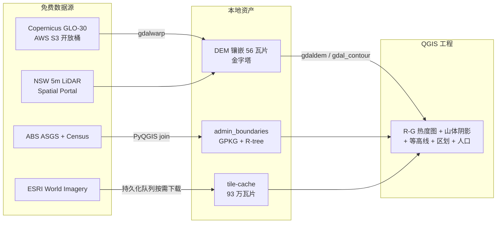

# QGIS 澳洲房产数据工程 · AU Property QGIS Pipeline

> 澳洲东南沿海房产分析的全套 QGIS 数据工程:离线卫星瓦片服务 + 30m/5m 地形热度图 + ABS 行政区划 + 人口密度,全部来自免费公开数据源,一条命令幂等导入。

[](https://qgis.org)
[](#-数据源)

---

## 数据层总览

| 图层组(自上而下) | 内容 | 数据源 |
|---|---|---|
| 人口密度·LGA/SAL | Census 2021 人口分级设色(默认隐藏) | ABS 2021 Census G01 DataPacks |
| 行政区划·SAL/LGA | ASGS 边界色块 + 名称标注(数据驱动着色) | ABS ASGS Ed3 LGA 2025 + SAL 2021 |
| 地形·等高线(50m) | 全带简化等高线 65.7 万条 | Copernicus GLO-30 |
| 地形·高程(R-G 热度图) | 0m 绿 → 1500m 红连续渐变,Multiply 叠加阴影 | Copernicus GLO-30(4 幅镶嵌) |
| 地形·山体阴影(30m) | 315°/45° 光照灰阶 | 同上 |
| 地形·精细·等高线(5m) | Coffs/Sydney 图幅 | NSW 官方 LiDAR DEM-AHD 5m |
| 本地瓦片底图 z0-17 | ESRI World Imagery 离线缓存 | 自建 tile-server(持久化队列按需下载) |

覆盖范围:**阿德莱德 → 墨尔本 → 悉尼 → 布里斯班** 东南沿海走廊,海岸线内侧 150km(54 块 1° Copernicus 瓦片,含 Kosciuszko 2111m)。

## 架构



## 快速开始

```bash
# 1. 瓦片服务器(缓存优先,未命中自动经持久化队列实时下载)
systemctl --user enable --now qgis-tile-server.service   # 监听 127.0.0.1:8088

# 2. 一键导入全部图层到 QGIS 工程(幂等,可重复执行)
bash scripts/qgis_import_all.sh au-property-master.qgs nsw-final.qgs
```

工程文件(`*.qgs`)以相对+绝对路径引用本地数据;大文件(Copernicus 瓦片、LiDAR、Census CSV)按 [DEM-sources-research.md](DEM-sources-research.md) 的实测直链下载。

## 数据源(全部免费公开)

| 数据源 | 内容 | 获取 |
|---|---|---|
| Copernicus GLO-30 | 全球 30m DEM,SW 角命名 1° 瓦片 | AWS S3 `copernicus-dem-30m`(直链 .tif,注意 zip 路径是坑) |
| NSW 5m LiDAR DEM | 图幅 zip,直链模板 `portal.spatial.nsw.gov.au/download/dem/56/{图幅}.zip` | 实测 5-24MB/s 直连 |
| ABS ASGS Ed3 | LGA/SAL 边界(GDA2020) | abs.gov.au digital-boundary-files |
| ABS Census 2021 G01 | 人口表(LGA/SAL) | abs.gov.au DataPacks + correspondence 链 |
| ESRI World Imagery | 卫星瓦片 | `server.arcgisonline.com`(本工程缓存为本地瓦片服务) |

⚠️ ABS SDMX API(旧域名已死/新域名地域封锁)与 ELVIS API(WAF 403)不可用,替代方案见 [DEM-sources-research.md](DEM-sources-research.md)。

## 脚本索引

| 脚本 | 作用 |
|---|---|
| `qgis_import_all.sh` | **唯一入口**:幂等导入全部图层 |
| `build_band_mosaic.sh` | 沿海带镶嵌重建 + 阴影/等高线 + 图层重导 |
| `tile-server.py` | 本地瓦片服务:缓存优先 / 持久化队列按需下载 / 占位图过滤 / 单任务串行 |
| `compute_band_tiles.py` | 海岸线折线 + 150km 内陆缓冲 → 瓦片清单(陆地侧判定) |
| `fetch_admin_boundaries.py` | ABS 边界下载 → GPKG |
| `build_admin_layers.py` | SAL→LGA 空间 join + 中心镇判定 + 颜色预计算 |
| `add_admin_layers.py` / `add_terrain_layers.py` / `add_terrain_5m.py` | 图层导入(锚定插入,幂等) |
| `add_population.py` | Census 人口 join(--fields-only / --layers-only 两阶段防段崩) |
| `set_xyz_zoom.py` | XYZ 图层 zmin/zmax 官方 API 修改 |
| `render_admin_check.py` | headless 渲染验证 + 色相统计 |

## 踩坑记录(重要)

1. **QGIS 缩放语义反直觉**:可见条件是 `maximumScale ≤ scale ≤ minimumScale`(maximumScale = 最放大界限)。设反了图层/标注会"消失"。
2. **伪彩色渲染器必须显式设 classification min/max**:漏设会持久化 `nan`,毒化颜色 LUT → **"低红高绿"反色假象**。
3. **`qgis_process gdal:hillshade` 有大面积黑块缺陷**(同参数 gdaldem 正常)→ 阴影用 `gdaldem -s 111120`(经纬度 DEM 必须)。
4. **Copernicus 瓦片按西南角命名**,且桶只有裸 `.tif`(zip 路径返回 NoSuchKey);AWS 桶仅 eu-central-1。
5. **GeoJSON 是 QGIS 最慢格式**:4 层 GeoJSON→GPKG 后工程加载快 **5.9 倍**。
6. **PyQGIS 退出阶段段崩**:写盘完成后 `sys.stdout.flush(); os._exit(0)` 根治。
7. **QgsColorRampShader 的符号引用需持有一个 Python 侧列表**,否则 C++ 悬垂指针在 `proj.write()` 时段崩。

## License

代码 MIT。数据层各自遵循来源许可:ABS/GA/NSW 政府数据(CC-BY 4.0 系)、Copernicus DEM(ESA 许可)、ESRI 瓦片遵循 Esri 服务条款(仅限个人使用,勿再分发缓存)。
